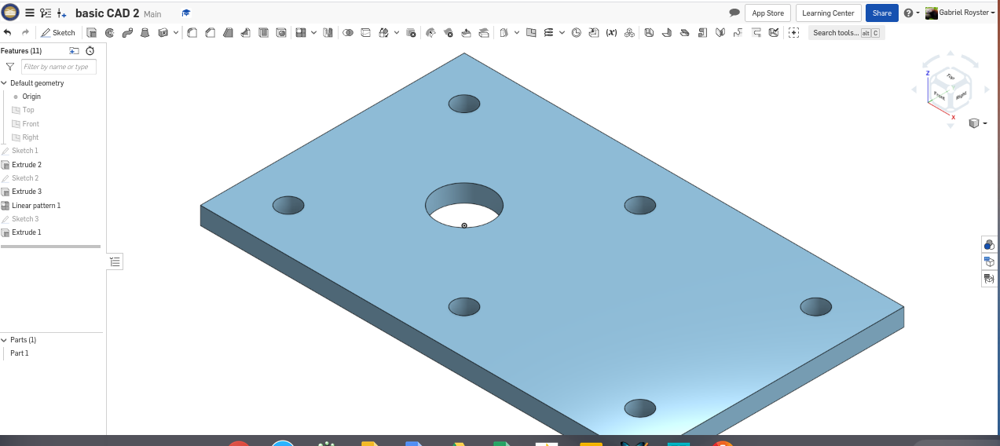
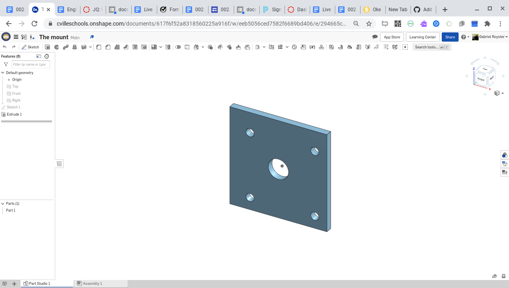

# BasicCAD

We are creating a caster.

---
## Table of Contents
* [Table of Contents](#Table-of-Contents)
* [Base](#Base)
* [Mount](#Mount)
* [Fork](#Fork)
* [Tire](#Tire)
* [Wheel](#Wheel)
* [AxleCollarBearings](#AxleCollarBearings)

## Base

### Description

The first assignment is to create the caster base.  The base's dimensions are 200 mm x 120 mm and 8 mm thick.  It has 6 holes 10 mm wide and 20 mm from the edge equally spaced along the edges.

### Evidence
[The Base in Onshape](https://cvilleschools.onshape.com/documents/0d70f655203ca304cb3c5b7d/w/f55603f962f6fc74f5548a68/e/41d730c570a8d75fce9f51b6)

### Image

### Reflection

This was my first Onshape part and [following along with Dr. Shields made it super easy.](https://www.youtube.com/watch?v=93BFUD-HAG8&feature=emb_title&scrlybrkr=5670f0b4)  I learned about 
* sketching (shortcut **shift-s**)
* constructions lines (shortcut **Q**)
* dimensions (shortcut **D**)
* extruding both add and remove (shortcut key **E**)
* linear patterns (no shortcut)

Onshape is awesome.  I found it really helpful to rename all my sketches.  It is going to be a GREAT year in engineering.

---

## Mount

### Description
I made the Mount which is a square with 5 holes to fit the fork inside of.
### Evidence
https://cvilleschools.onshape.com/documents/617f6f52a8318560225a916f/w/eeb5056ced7582f6689bd406/e/294665cef34d1a10abcf755d
### Image

### Reflection
The mount was fun to make and made me really feel like I underst and CAD.
---

## Fork

### Description
The base to fit the wheel of the caster project.
### Evidence
https://cvilleschools.onshape.com/documents/6ca4d7aa9c812687c4ebb00f/w/23768fb105910873cce377a2/e/3e95bcf66a4f5a614f44f4d1
### Image

### Reflection
I learned how to mirror things in CAD and how to put fillets on my work.
---

## Tire

### Description
The tire goes around the wheel in our caster project.
### Evidence
https://cvilleschools.onshape.com/documents/1ea5c7cf18ded946e2c4bdac/w/127a6379fb4ad654f2526d34/e/999341ae11b8960f6130bec1
### Image

### Reflection
I learned that you can manipulate shapes like trapazoids into circles.
---

## Wheel

### Description
The Wheel is the main function of the caster project.
### Evidence
https://cvilleschools.onshape.com/documents/46bb1c2b9e0f88116e2cc1b5/w/17f509ce9b6f2e06aa61ef36/e/814e4ef591f03223d3a16ba8
### Image

### Reflection
The Wheel was the most challenging part of the caster project, I learned how to use construction lines and the mirror features in Onshape.
---

## AxleCollarBearings

### Description

### Evidence

### Image

### Reflection

---
